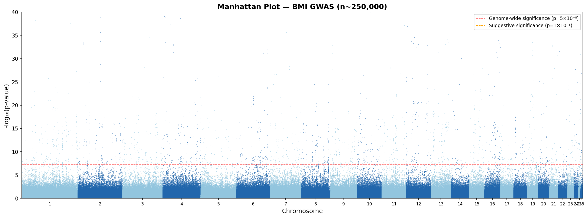

# GWAS Manhattan Plot — BMI Association Study

## Overview
This project demonstrates the visualisation and interpretation of Genome-Wide 
Association Study (GWAS) summary statistics using a large-scale BMI dataset 
(n~250,000). A Manhattan plot was generated to identify SNPs exceeding 
genome-wide significance thresholds.

## Dataset
- **Source:** GIANT Consortium BMI GWAS summary statistics
- **Samples:** ~250,000 individuals
- **SNPs:** 2,554,637
- **Trait:** Body Mass Index (BMI)

## Methods
- Parsed and processed GWAS summary statistics in Python
- Calculated -log₁₀(p-values) for all SNPs
- Visualised genome-wide association signals across all 26 chromosomes
- Applied standard significance thresholds:
  - Genome-wide significance: p = 5×10⁻⁸
  - Suggestive significance: p = 1×10⁻⁵

## Key Findings
- Multiple SNPs exceed genome-wide significance across chromosomes 1, 2, 4, 6, 
  8, 12 and 16
- Results are consistent with known BMI-associated loci in the literature

## Tools Used
- Python (pandas, numpy, matplotlib)
- Google Colab
- GIANT Consortium public GWAS data

## Output

## Relevance
Manhattan plots are a core output of SNP array studies. This project 
demonstrates familiarity with GWAS data structure, p-value thresholding, 
and genomic visualisation — skills directly applicable to SNP array 
analysis pipelines.
